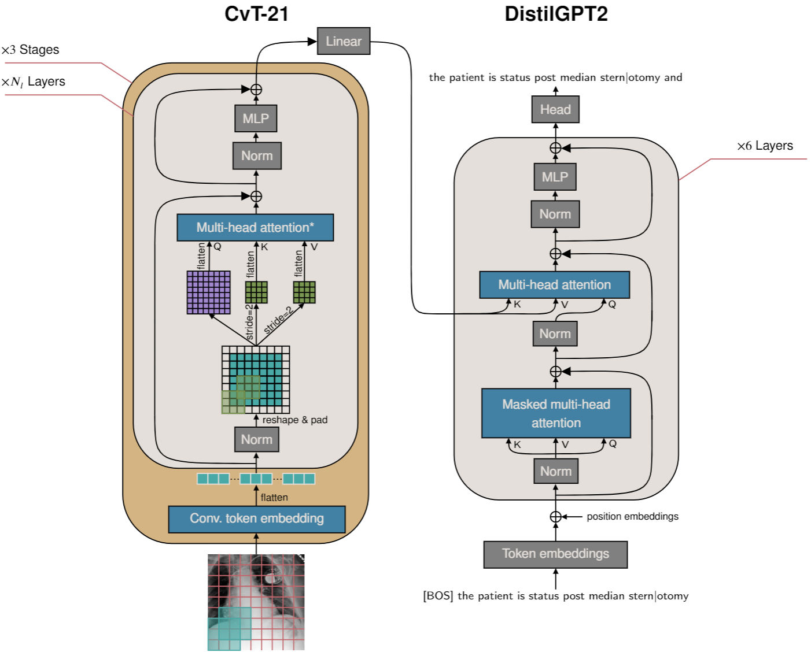

# CvT2DistilGPT2
```
@article{nicolson_improving_2023,
	title = {Improving chest {X}-ray report generation by leveraging warm starting},
	issn = {0933-3657},
	url = {https://www.sciencedirect.com/science/article/pii/S0933365723001471},
	doi = {10.1016/j.artmed.2023.102633},
	urldate = {2023-08-21},
	journal = {Artificial Intelligence in Medicine},
	author = {Nicolson, Aaron and Dowling, Jason and Koopman, Bevan},
	month = aug,
	year = {2023},
	keywords = {Chest X-ray report generation, Image captioning, Multi-modal learning, Warm starting},
	pages = {102633},
}
```

#### Improving Chest X-Ray Report Generation by Leveraging Warm-Starting
- This repository houses the code for CvT2DistilGPT2 from https://doi.org/10.1016/j.artmed.2023.102633.
- Implemented in [PyTorch Lightning](https://pytorch-lightning.readthedocs.io/).
- CvT2DistilGPT2 is an encoder-to-decoder model that was developed for chest X-ray report generation. 
- Its encoder is the Convolutional vision Transformer (CvT) warm-started with an ImageNet-21K checkpoint.
- Its decoder is DistilGPT2 (which describes the architecture of the decoder as well as the checkpoint).
- Checkpoints for CvT2DistilGPT2 on MIMIC-CXR and IU X-Ray are available.

||
|----|
| <p align="center"> <a>CvT2DistilGPT2 for MIMIC-CXR. Q, K, and V are the queries, keys, and values, respectively, for multi-head attention. * indicates that the linear layers for Q, K, and V are replaced with the convolutional layers depicted below the multi-head attention module. `[BOS]` is the beginning-of-sentence special token. `N_l` is the number of layers for each stage, where `N_l=1`, `N_l=4`, and `N_l=16` for the first, second, and third stage, respectively. The head for DistilGPT2 is the same used for language modelling. Subwords produced by DistilGPT2 are separated by a vertical bar.</a> </p> |

## Installation:
After cloning the repository, install the required packages in a virtual environment.
The required packages are located in `requirements.txt`:
```shell script
python -m venv --system-site-packages venv
source venv/bin/activate
python -m pip install --upgrade pip
python -m pip install --upgrade -r requirements.txt --no-cache-dir
```

## Model checkpoints:
 CvT2DistilGPT2 checkpoints for MIMIC-CXR and IU X-Ray can be found at: https://doi.org/10.25919/ng3g-aj81 (click on the *files* tab to download individual checkpoints). 
 
 Place the checkpoints in the checkpoint directory for each model of each task, e.g., place the checkpoint:
  
 

  at the path: `checkpoints/mimic_cxr_jpg_chen/cvt_21_to_gpt2_scst/epoch=0-val_chen_cider=0.410965.ckpt`.
  
##### Note: the `experiment` directory can be changed for each task with the variable `exp_dir` in `task/mimic_cxr_jpg_chen/paths.yaml` and `task/iu_x_ray_chen/paths.yaml`

## Datasets:   

### For MIMIC-CXR: 
1. Download MIMIC-CXR-JPG from: 
    ```
    https://physionet.org/content/mimic-cxr-jpg/2.0.0/
    ```
2. Place the files in `dataset/mimic_cxr_jpg` so that the following path exists `dataset/mimic_cxr_jpg/physionet.org/files/mimic-cxr-jpg/2.0.0/files`.

3. Download the [Chen *et al.*](https://aclanthology.org/2020.emnlp-main.112.pdf) labels for MIMIC-CXR from:
    ```
    https://github.com/cuhksz-nlp/R2Gen
    ```
    Or
    ```
    https://github.com/cuhksz-nlp/R2GenCMN
    ```
    Or
    ```
    https://www.dropbox.com/s/ojcc0kvgzzpblf8/dataset.zip?dl=0
    ```
4. Place `annotations.json` in `dataset/mimic_cxr_chen` such that its path is `dataset/mimic_cxr_chen/annotations.json`

### For IU X-Ray: 

1. Download the [Chen *et al.*](https://aclanthology.org/2020.emnlp-main.112.pdf) labels and the chest X-rays in `png` format for IU X-Ray from:
    ```
    https://github.com/cuhksz-nlp/R2Gen
    ```
    Or
    ```
    https://github.com/cuhksz-nlp/R2GenCMN
    ```
    Or
    ```
    https://www.dropbox.com/s/ojcc0kvgzzpblf8/dataset.zip?dl=0
    ```

2. Place the files into `dataset/iu_x-ray_chen` such that their paths are `dataset/iu_x-ray_chen/annotations.json` and `dataset/iu_x-ray_chen/images`.

Note: the `dataset` directory can be changed for each task with the variable `dataset_dir` in `task/mimic_cxr_jpg_chen/paths.yaml` and `task/mimic_cxr_jpg_chen/paths.yaml`

## Run testing:   

The model configurations for each task can be found in its `config` directory, e.g. `config/test_mimic_cxr_chen_cvt2distilgpt2.yaml`. To run testing:

```shell
dlhpcstarter -t mimic_cxr_chen -c config/test_mimic_cxr_chen_cvt2distilgpt2.yaml --stages_module stages --test
```
or for IU X-Ray:
```shell
dlhpcstarter -t iu_x_ray_chen -c config/test_iu_x_ray_chen_cvt2distilgpt2.yaml --stages_module stages --test
```

See [`dlhpcstarter==0.1.2`](https://github.com/csiro-mlai/dl_hpc_starter_pack) for more options. 

Note: data will be saved in the experiment directory (`exp_dir` in the configuration file).

## Results:
The results should be similar to the following presented results:

 - MIMIC-CXR with the labels of Chen `at el.` and checkpoint: `mimic_cxr_jpg_chen/cvt_21_to_distilgpt2/epoch=8-val_chen_cider=0.425092.ckpt`:
    ```
    ┏━━━━━━━━━━━━━━━━━━━━━━━━━━━┳━━━━━━━━━━━━━━━━━━━━━━━━━━━┓
    ┃        Test metric        ┃       DataLoader 0        ┃
    ┡━━━━━━━━━━━━━━━━━━━━━━━━━━━╇━━━━━━━━━━━━━━━━━━━━━━━━━━━┩
    │    test_ce_f1_example     │     0.366626501083374     │
    │     test_ce_f1_macro      │    0.2595527172088623     │
    │     test_ce_f1_micro      │    0.4410667403620285     │
    │   test_ce_num_examples    │          3858.0           │
    │ test_ce_precision_example │    0.41827061772346497    │
    │  test_ce_precision_macro  │    0.36531099677085876    │
    │  test_ce_precision_micro  │    0.4927446742821859     │
    │  test_ce_recall_example   │    0.36703819036483765    │
    │   test_ce_recall_macro    │    0.25426599383354187    │
    │   test_ce_recall_micro    │    0.39919959979989994    │
    │     test_chen_bleu_1      │    0.39294159412384033    │
    │     test_chen_bleu_2      │    0.24798792600631714    │
    │     test_chen_bleu_3      │    0.17156976461410522    │
    │     test_chen_bleu_4      │    0.12690401077270508    │
    │      test_chen_cider      │    0.3898723410220536     │
    │     test_chen_meteor      │    0.15444843471050262    │
    │  test_chen_num_examples   │          3858.0           │
    │      test_chen_rouge      │    0.28650081595125004    │
    └───────────────────────────┴───────────────────────────┘
    ```
 - The generated reports are given in: `experiment/test_mimic_cxr_chen_cvt2distilgpt2/trial_0/generated_reports/test_reports_epoch-0_16-05-2023_10-20-48.csv`


 - IU X-Ray with the labels of Chen `at el.` and checkpoint: `iu_x_ray_chen/cvt_21_to_distilgpt2/epoch=10-val_chen_cider=0.475024.ckpt`:
    ```
    ┏━━━━━━━━━━━━━━━━━━━━━━━━━━━┳━━━━━━━━━━━━━━━━━━━━━━━━━━━┓
    ┃        Test metric        ┃       DataLoader 0        ┃
    ┡━━━━━━━━━━━━━━━━━━━━━━━━━━━╇━━━━━━━━━━━━━━━━━━━━━━━━━━━┩
    │    test_ce_f1_example     │    0.5079095959663391     │
    │     test_ce_f1_macro      │    0.04815409332513809    │
    │     test_ce_f1_micro      │    0.5434782608695652     │
    │   test_ce_num_examples    │           590.0           │
    │ test_ce_precision_example │     0.508474588394165     │
    │  test_ce_precision_macro  │   0.036319613456726074    │
    │  test_ce_precision_micro  │    0.5084745762711864     │
    │  test_ce_recall_example   │    0.5076271295547485     │
    │   test_ce_recall_macro    │    0.0714285746216774     │
    │   test_ce_recall_micro    │    0.5836575875486382     │
    │     test_chen_bleu_1      │    0.4734129309654236     │
    │     test_chen_bleu_2      │    0.30362269282341003    │
    │     test_chen_bleu_3      │    0.22399061918258667    │
    │     test_chen_bleu_4      │    0.17524345219135284    │
    │      test_chen_cider      │    0.6941080384291234     │
    │     test_chen_meteor      │    0.19990624487400055    │
    │  test_chen_num_examples   │           590.0           │
    │      test_chen_rouge      │    0.3761140813853112     │
    └───────────────────────────┴───────────────────────────┘

    ```

 - The generated reports are given in: `experiment/test_iu_x_ray_chen_cvt2distilgpt2/trial_0/generated_reports/test_reports_epoch-0_16-05-2023_12-46-42.csv`

 - Note that there are differences to the pre-print available online. There are errors in the preprint.

## Encoder and decoder checkpoints for warm-starting training:

### CvT-21 Checkpoint

Download `CvT-21-384x384-IN-22k.pth` from this [Microsoft model zoo](https://onedrive.live.com/?authkey=%21AMXesxbtKwsdryE&id=56B9F9C97F261712%2115004&cid=56B9F9C97F261712) and place it in `checkpoints` such that its path is `checkpoints/CvT-21-384x384-IN-22k.pth`

### DistilGPT2 Checkpoint

Download `config.json`, `tokenizer.json`, `pytorch_model.bin`, and `vocab.json` from [https://huggingface.co/distilgpt2/tree/main](https://huggingface.co/distilgpt2/tree/main) and place them in `checkpoints/distilgpt2`, e.g., `checkpoints/distilgpt2/config.json`.

To download everything, you can use `git clone https://huggingface.co/distilgpt2` (note that `git lfs install` is needed).


## Run training:
   
To train with MIMIC-CXR with the labels of Chen `at el.`:
 
```
dlhpcstarter -t mimic_cxr -c config/train_mimic_cxr_chen_cvt2distilgpt2.yaml --stages_module stages --train --test
```

To train with IU X-Ray with the labels of Chen `at el.`:
 
```
dlhpcstarter -t mimic_cxr -c config/train_mimic_cxr_chen_cvt2distilgpt2.yaml --stages_module stages --train --test
```

See [`dlhpcstarter==0.1.2`](https://github.com/csiro-mlai/dl_hpc_starter_pack) for more options. 

## Help
If you need help, please leave an issue and we will get back to you as soon as possible.


